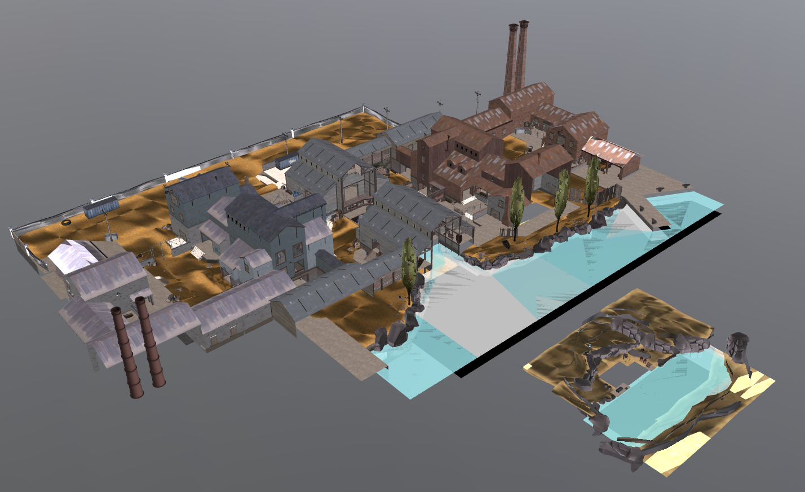

# vbsp-to-gtlf

Convert Valve BSP files to GLTF files

## Usage

```bash
vbsp-to-gltf input.bsp output.glb
```

## Model optimization

The output for the converter isn't particularly optimized, it's strongly recommended to run the output through [gltfpack](https://github.com/zeux/meshoptimizer) before usage.



`koth_bagel` as vieweed with the [PlayCanvas model viewer](https://playcanvas.com/viewer).